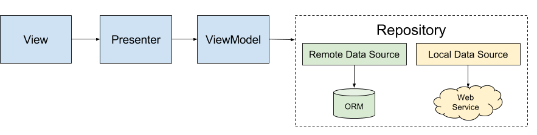

Github Feed Sample
======

A sample Android app which showcases advanced usage of Kotlin, Dagger2, Retrofit2, RxJava2, and some Architecture Components.
The diagram below demonstrates how the MVP architecture was used to achieve this:

As seen above, the architecture used is not pure MVP since it includes a ViewModel between the Presenter and Model.
This is the ViewModel provided by Android's Architecture Components. It's used to hold data from the repository in memory which can persist device configuration changes such as rotation.
The Repository in this sample app retrieves only remote data from a server, but it can easily have a local data source added via ORMs such as Room, Realm or Object Box.

Usage
======

When running the app, ensure that the latest Play Services are available due to downloadable fonts.

To run tests use the following Gradle tasks:

 * runAllTests
 * runUnitTests
 * runInstrumentationTests
